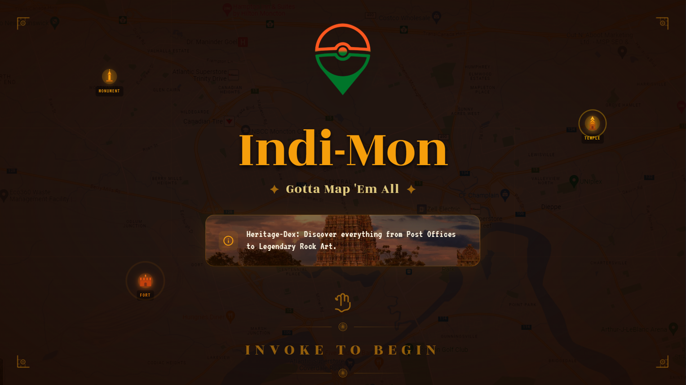
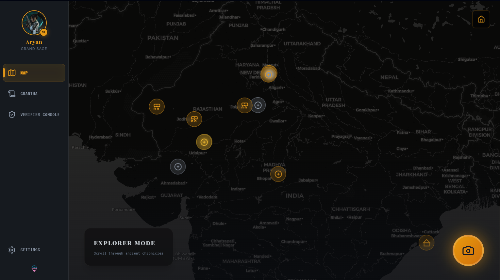
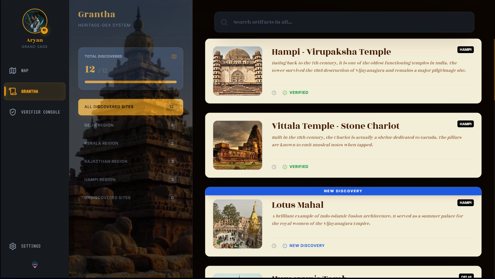

# 🏛 Indi-Mon
**A Geospatial AI Platform for Structured Heritage Documentation**  

**Hackathon:** CodeZen 2.0 (36-hour hackathon at GTB4CEC)  

---

## Table of Contents
1. [Project Overview](#project-overview)  
2. [Problem Statement](#problem-statement)  
3. [System Architecture](#system-architecture)  
   - [Frontend](#frontend)  
   - [Geospatial Engine](#geospatial-engine)  
   - [AI Validation Layer](#ai-validation-layer)  
   - [Backend Infrastructure](#backend-infrastructure)  
   - [Database Design](#database-design)  
   - [Image Storage Pipeline](#image-storage-pipeline)  
   - [Verification Layer](#verification-layer)  
4. [Data Flow](#data-flow)  
5. [Security & Performance](#security--performance)  
6. [Revenue Model](#revenue-model)  
8. [Future Expansion](#future-expansion)  

---

## Project Overview
Indi-Mon is a **structured, AI-validated, geospatial heritage documentation platform**. It allows users to capture heritage site images, validates them in real-time using client-side AI, and stores structured metadata in a Supabase/PostgreSQL backend.  

> **This is not a game.**  
> **This is digital public infrastructure.**

---

## Problem Statement
- India has ~500,000 heritage structures, but fewer than 10,000 are formally documented (~98% gap).  
- Manual surveys are slow, expensive, and lack real-time verification.  
- No scalable, geo-aware system exists for structured heritage data ingestion and storage.

**Goal:** Build a scalable, AI-augmented geospatial documentation platform for heritage sites.

---

## System Architecture

### Frontend
- **Stack:** React (Vite), Tailwind CSS, Mapbox GL JS, HTML5 Media Capture API  
- **Responsibilities:**  
  - Map rendering & GPS detection  
  - Geo-tagged image capture  
  - Metadata entry form  
  - AI validation feedback  

### Geospatial Engine
- **Map Engine:** Mapbox GL JS  
- **Features:**  
  - Dynamic map rendering with GeoJSON overlays  
  - Heatmaps of documented vs undocumented regions  
  - Spatial clustering & proximity detection  

### AI Validation Layer
- **Framework:** TensorFlow.js  
- **Model:** MobileNet or custom transfer learning  
- **Logic:**  
  - Detect if uploaded image is a structure/monument  
  - Client-side inference for faster feedback and reduced backend load  

### Backend Infrastructure
- **Platform:** Supabase  
- **Core Components:**  
  - Auth, Postgres, Storage, RLS (Row-Level Security), Edge Functions  

### Database Design (PostgreSQL)
**users table:**  
- id (UUID, PK), email, role (admin / contributor), created_at  

**heritage_sites table:**  
- id (UUID, PK), title, description, latitude, longitude, geo_point (PostGIS), image_url, structure_type, condition_status, material_type, plaque_present, ai_confidence, verification_status (pending/verified/rejected), created_by (FK -> users.id), created_at  

### Image Storage Pipeline
1. Image captured on frontend  
2. Uploaded to Supabase Storage  
3. URL stored in heritage_sites table  

### Verification Layer
- Multi-tier: AI pre-filter → Metadata validation → Admin review  
- Confidence scoring determines verification queue priority  

---

## Data Flow
```text
User Opens App
      ↓
GPS Location Captured
      ↓
Mapbox Displays Nearby Sites
      ↓
User Captures Image
      ↓
TensorFlow.js Validation
      ↓
If Valid → Metadata Form
      ↓
Image → Supabase Storage
Metadata → Supabase Postgres
      ↓
Verification Queue
      ↓
Admin Approval
      ↓
Official Registry Entry
```

---

## Screenshots

### Landing Page


### Profile Page


### Map Page


### Grantha Page


---

## Security & Performance
- Supabase Row-Level Security enabled
- Only authenticated users can submit
- Only admins can verify entries
- Signed URLs for protected images
- Rate limiting via Edge Functions
- Metadata validation before DB write
- Client-side AI reduces backend load
- Lazy-loaded map tiles & compressed images
- Indexed spatial queries for speed

---

## Revenue Model (Simple & Realistic)

1. Paid Research Dataset Access
  - Students & researchers buy district-level datasets (CSV/PDF/GeoJSON)
  - Pricing: ₹999–₹1,999 per district/project
  - Easy, low-overhead revenue
2. Premium Contributor Plan
  - Free: submit entries, view public map
  - Premium (₹199–₹299/month): advanced filters, personal dashboard, verified contributor badge
  - Recurring revenue from serious users
    
Total achievable early revenue: ~₹40K/month without relying on large clients or government contracts.

---

## Future Expansion

- Drone & satellite imagery integration
- Multi-model AI validation
- Structural damage detection
- Public API for researchers
- 3D heritage reconstruction (long-term)
